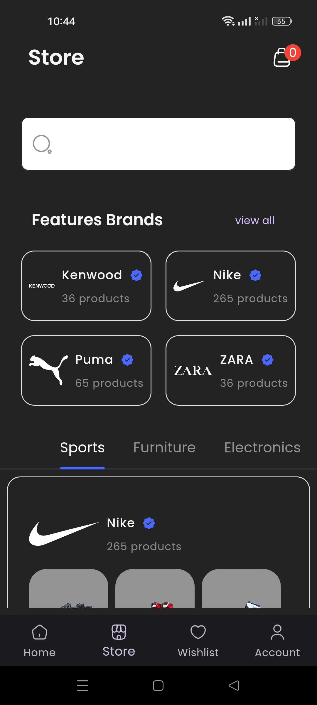

# Flutter E-commerce Demo App

It is a E-commerce project of Flutter and built for andriod and ios. The purpose of developing this application is that enhance my skill and try to gain little experience about challenges when developing a complex application. The project has been designed by Application, Domain and Data layer and try to ignore as much as possible TightlyCoupled.

This is a example of Flutter Bloc Architecture diagram which I designed the application. Necessary features, I covered in this application

- login with email and password or google,
- signup and email verfication
- AutoComplete Search
- filter the products with category or brand
- able to select different variation of a product and set quantity
- in cart page, display and remove cart item
- checkout page
- account setting and edit account page
- add address

## Setup

Run the following commands from your terminal:

- `git clone https://github.com/Torjoy1997/Flutter_TShop_Demo.git` to clone this repository
- `flutter pub get` to install all dependencies

## Screenshots of Output

# light mode:

  
   
  
  
   
  

# drak

  
   
  
  
   
  

## using tools

- **Programming Language && Framework**: Dart, Flutter.
- **State managment**: Bloc, Revier Pod,
- **Backend Service**: FireBase
- **assets from**: `https://codingwitht.com/product/flutter-ecommerce-app-with-firebase/` free version
